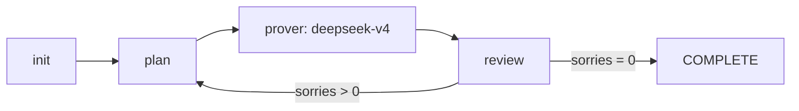

# Archon on DeerFlow 🏛️🦞

将 Archon Lean4 定理证明工作流迁移至 DeerFlow（LangGraph 编排）的独立部署套件。

## 快速开始

```bash
git clone https://github.com/your-org/archon-deerflow.git
cd archon-deerflow
cp .env.example .env   # 编辑填入你的 API key
./scripts/bootstrap.sh  # 一键部署
```

## 系统架构

```
archon-deerflow/
├── overlay/                    # ← DeerFlow 定制层
│   ├── config.yaml               # 含 subagents 配置
│   ├── extensions_config.json    # 含 lean-lsp MCP
│   ├── backend/
│   │   ├── langgraph.json        # 注册 archon_workflow 图
│   │   ├── Dockerfile            # 含 Lean 安装
│   │   └── workflows/
│   │       └── archon_graph.py   # LangGraph 编排核心
│   └── skills/custom/           # 5 个 Archon 技能
│       ├── archon-lean4/
│       ├── archon-init/
│       ├── archon-plan/
│       ├── archon-prover/
│       └── archon-review/
├── scripts/                    # 部署工具
│   ├── bootstrap.sh               # 一键部署
│   └── install-lean.sh            # Lean 安装器
├── samples/                    # 示例项目
│   └── simple-test/
├── .env.example                # 环境变量模板
└── README.md
```

## 工作流



| 节点 | 功能 | 调用 |
|------|------|------|
| init | 检测项目，初始化 .archon/ | 本地 Python |
| plan | 扫描 sorry，排优先级 | 本地 Python |
| prover | 调用 LLM 填充证明 | DeerFlow deepseek-v4 |
| review | 编译验证，生成日志 | 本地 Python |

## 前置要求

- OS: Linux / macOS / WSL2
- 已安装: Docker, Git
- 一个 LLM API key（DeepSeek / OpenAI / 任意）

## API Keys

在 `.env` 中设置至少一个模型 API key：

```bash
# DeepSeek（推荐 — 已预配置）
DEEPSEEK_API_KEY=sk-xxx

# 或 OpenAI 兼容
OPENAI_API_KEY=sk-xxx
```

## 自定义模型

编辑 `overlay/config.yaml` 中的 `models` 段可切换任意 LLM：

```yaml
models:
  - name: my-model
    use: langchain_openai:ChatOpenAI
    model: gpt-5.4
    api_key: sk-xxx
    base_url: https://your-endpoint/v1
```

然后在 `overlay/backend/workflows/archon_graph.py` 中将 `"deepseek-v4"` 改为你的模型名。

## 部署说明

### Docker 部署（推荐）

```bash
./scripts/bootstrap.sh
# 等效于：
#   1. git clone DeerFlow
#   2. 应用 overlay
#   3. docker compose build
#   4. 容器内安装 Lean
#   5. docker compose up -d
```

### 运行测试

```bash
# 在工作流目录上触发完整循环
cd deer-flow/backend
uv run python3 -c "
from deerflow.archon_workflow import run_archon_workflow
result = run_archon_workflow('/path/to/lean-project')
print(result['current_stage'])
"
```

## 许可

基于 DeerFlow (MIT) + Archon (MIT)。
